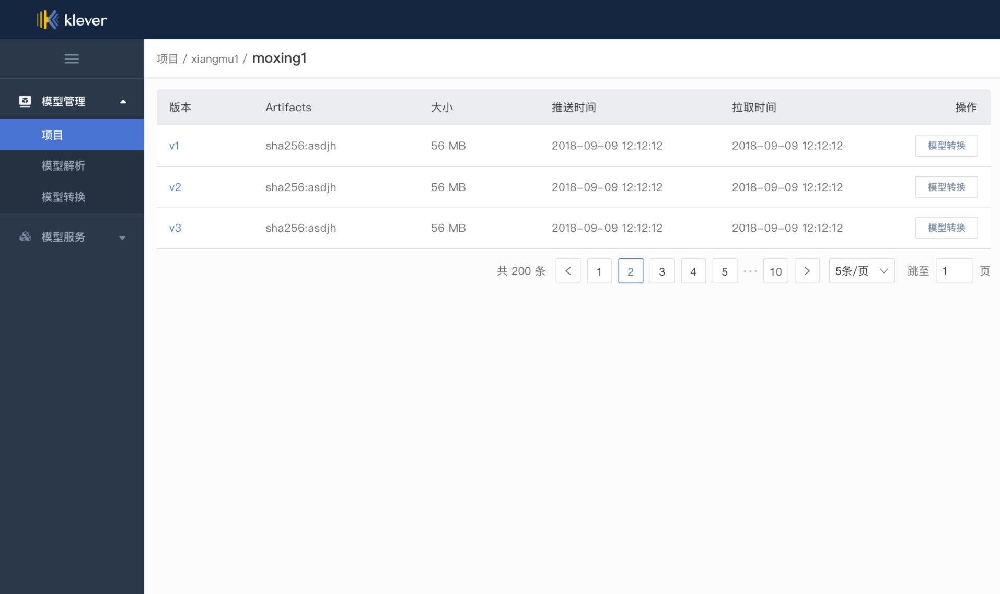
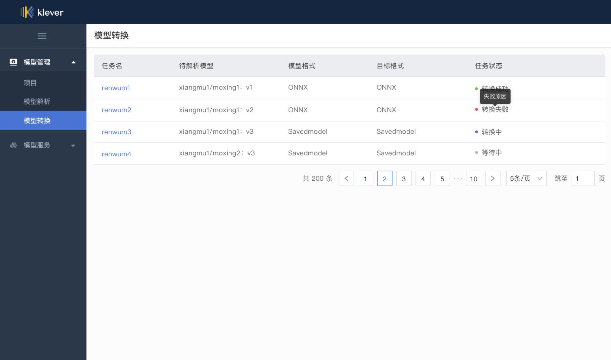

# Klever Model Registry

[](https://goreportcard.com/report/github.com/kleveross/klever-model-registry)
[](https://travis-ci.com/kleveross/klever-model-registry)
[](https://coveralls.io/github/kleveross/klever-model-registry?branch=master)

<a href="https://join.slack.com/t/kleveross/shared_invite/zt-g0eoiyq9-9OwiI7c__oV79bh_94MyTw">
    </a>

English | [中文](./README_zh.md)

Klever Model Registry is a Cloud Native ML model registry. Use Klever Model Registry in order to:

- Manage your ML models
- Version and deliver your ML models with the existing infrastructures
- Keep track of ML models' hyperparameters and so on to help decision makers
- Convert models between different formats ( e.g. TensorFlow SavedModel, ONNX )
- Serve the model ( Coming Soon! )
- Get the standalone executable program to deploy ML model inference services on edge devices/servers ( Coming Soon! )

Klever Model Registry's features:

- Deploy with Docker and Kubernetes
- Keep non-Invasive for your business
- Manage ML models like Docker ( With the help of [kleveross/ormb](https://github.com/kleveross/ormb) )
- Reuse Harbor to store models, without any new infrastructure
- Extract models signatures for:
    - SavedModel
    - ONNX
    - GraphDef
    - NetDef
    - Keras H5
    - CaffeModel
    - TorchScript
    - MXNetParams
    - PMML 
- Convert models from:
    - MXNetParams to ONNX
    - Keras H5 to SavedModel
    - CaffeModel to NetDef

## UI MockUp

<p align="center">

</p>

<p align="center">

</p>

## Installation

### Build the image

Clone:

```
$ git clone https://github.com/kleveross/klever-model-registry
$ cd klever-model-registry
```

Get the dependencies:

```
$ go mod tidy
```

Build:

```
$ make docker-build
```

### Install

#### Install Harbor
[Harbor](https://github.com/goharbor/harbor) is registry for the training model in klever-model-registry, please refer to the installation of Harbor [harbor-helm installation](https://github.com/goharbor/harbor-helm)

#### Install klever-model-registry

```bash
$ kubectl create namespace kleveross-system
$ git clone https://github.com/kleveross/klever-model-registry
$ cd klever-model-registry/manifests
$ helm install klever-model-registry ./klever-model-registry --namespace=kleveross-system --set ormb.domain={harbor address}
$ helm install klever-modeljob-operator ./klever-modeljob-operator --namespace=kleveross-system --set ormb.domain={harbor address}
```

## Community

klever-model-registry project is part of Klever, a Cloud Native Machine Learning platform.

The Klever slack workspace is klever.slack.com. To join, click this [invitation to our Slack workspace](https://join.slack.com/t/kleveross/shared_invite/zt-g0eoiyq9-9OwiI7c__oV79bh_94MyTw).
